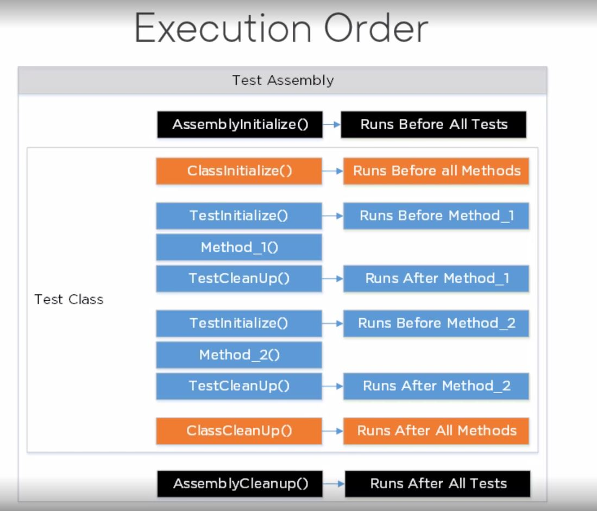

# .NET5 MSTest Unit Testing
App to demonstrate unit testing approaches using .NET MSTest library

## Target Framework
.Net 5

## About/Concepts

### Testing tools

```bash
Unit Test framework
-> set of classes and tools
-> in all editions of VisualStudio

Data-driven testing
-> read data from table to guide testing

dotnet test
-> command line utility
-> automate tests
-> log results

code converage
-> determines if any methods have not been tested
-> available in VS enterprise edition only
```


### Exception Handling test in Unit Test

```bash
Have 2 approaches

using [ExpectedException] attribute
-> specify typeof() exception

Using try...catch
-> good when using data-driven tests
```


### Checks for good programming practices

- Avoid Hard-coding by using constants
- Use TestContext to write outputs
- use a settings file
- setup and teardown in test (e.g. create a file for test and then delete)
- create a base test class


### Initialize and cleanup

Create methods to run prior or after tests
- decorate methods with special attributes
- they can be run at assembly, class, test level or before and after each test


Types
- Initialization methods
- Cleanup methods

```bash
Initialization Attributes
-------------------------
1. AssemblyInitialize
-> called once for project
-> setup resources for all test classes in assembly

2. ClassInitialize
-> called once for a class
-> setup resources for all tests within a class

3. TestInitialize
-> called once for each test method
-> set or reset resources needed for each test
```

```bash
Cleanup Attributes
------------------
1. AssemblyCleanup
-> called once after all tests in assembly have run

2. ClassCleanup
-> called once after all tests in class have run

3. TestCleanup
-> called once after each test method has run
```


### Execution Order of Initialization and Cleanup

Execution Order of methods for one assembly, one class having two methods:

```bash
Test Assembly -> Test Class -> Method1 & Method2

1. AssemblyInitialize()

2. ClassInitialize()

3. TestInitialize()
4. Method1()
5. TestCleanup()

6. TestInitialize()
7. Method2()
8. TestCleanup()

9. ClassCleanup()

10. AssemblyCleanup()
```




### Attributes help to organize unit tests

```bash
Grouping
-> Owner (who wrote the test/ who get notified if it fails(thru source control system))
-> Priority (arbitrary value you assign 1,2,3 etc / can filter using command-line utility)
-> TestCategory (arbitrary value you assign "Valid","ExceptionCheck" etc / can filter using command-line utility)

Action
-> DataRow (creates 1 to n sets of data to pass to test / [DataRow(1,1)], [DataRow(2,1)] => AreNumbersEqual(int num1, int num2))
-> DeploymentItem (add a filename to attribute e.g [DeploymentItem("File.txt")] / Add "File.txt" to test project / Copies file to deployment directory prior to test running)
-> Ignore (skip a test / keep test in your class / come back to it later)
-> Timeout (how long to wait for test to complete / fails if not complete within interval specified / time in ms)

Informational
-> Description (test description)

Data-driven
-> DataSource (available in .net framework but not in .net5)
```


### Assert classes

Don't have to write your own assertions. Save your time by using builtin methods.

1. Assert

```bash

- Postive
--- AreEqual (for case sensitive string use as AreEqual("val" , "Val") / for case insensitive string use as AreEqual("val" , "Val", true) / for specific culture use as AreEqual("val" , "Val", CultureInfo object))
--- AreSame (for object comparison)
--- IsTrue
--- IsInstanceTypeOf
--- IsNull

- Negative
--- AreNotEqual
--- AreNotSame
--- IsFalse
--- IsNotInstanceTypeOf
--- IsNotNull

- Other
--- Fail
--- Inconclusive

```
2. StringAssert

```bash

- Regex
--- Matches
--- DoesNotMatch

- Contains
- StartsWith
- EndsWith

```

3. CollectionAssert

```bash

- Equality (Must be in the same order, for same object)
--- AreEqual
--- AreNotEqual

- Equivalency (Can be in any order)
--- AreEquivalent
--- AreNotEquivalent

-Comparer (check for some obj property / for obj collections / create our own comparer method)

- Whats in a collection
--- AllItemsAreInstanceOfType
--- AllItemsAreNotNull
--- AllItemsAreUnique

- Contains
- DoesNotContain

- IsSubsetOf
- IsNotSubsetOf

```


### Consolidate Test by making them data-driven

- Add more tests without modifying code
- Use try...catch for exceptions
- Record messages with data values

```bash
Steps:
- Create a table to hold test data
- Use data from table for testing
- Add code to base class
--- Connect to table to retrieve data
--- Build a DataTable
-Loop through DataTable rows

Data-Driven Testing
- ELiminates creating multiple test methods
- Create a table to hold input & output
- Retrieve rows from table
- Use test data (input & output) to call method
```


### Automating Unit tests with VS.Test.Console

```bash

1. Using dotnet test command
-> run from developer cmd prompt
-> log to console, .trx, .html file
-> run all tests
-> run test starting with specific name.
-> run tests filtered by Priority, Name, or TestCategory
-> allow to schedule with Task Scheduler

commands:
dotnet test MyClassesTest.csproj --settings MyClasses.runsettings


2. Using loggers (built-in)
-> to console (quiet, minimal, normal, detailed)
-> to .trx file (for viewing in Visual Studio)
-> to .html file

commands:
dotnet test MyClassesTest.csproj --settings MyClasses.runsettings --logger "console;verbosity=detailed"
dotnet test MyClassesTest.csproj --settings MyClasses.runsettings --logger "trx"
dotnet test MyClassesTest.csproj --settings MyClasses.runsettings --logger "html"


3. Run specific tests using a filter
-> use --filter "Name=TestName" attribute to run just that one test
-> use --filter "Name~TestName" attribute to run just matching test names
-> use --filter "(Name=TestName1) | (Name=TestName2)" attribute to run two test matching names
-> use --filter "Priority=1" attribute to run all test with priority 1
-> use --filter "TestCategory=NoException" attribute to run all test with TestCategory = NoException

commands:
dotnet test MyClassesTest.csproj --settings MyClasses.runsettings --filter "Name=FileNameDoesNotExist"
dotnet test MyClassesTest.csproj --settings MyClasses.runsettings --filter "Name~FileName"
dotnet test MyClassesTest.csproj --settings MyClasses.runsettings --filter "(Name=FileNameDoesNotExist) | (Name=IsAllLowerCaseTest)"
dotnet test MyClassesTest.csproj --settings MyClasses.runsettings --filter "Priority=1"
dotnet test MyClassesTest.csproj --settings MyClasses.runsettings --filter "Priority=0"
dotnet test MyClassesTest.csproj --settings MyClasses.runsettings --filter "TestCategory=NoException"

```
